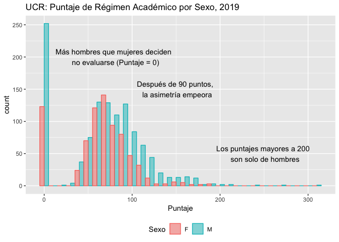

UCR: Puntajes de Régimen Académico de profesores en propiedad, 2019
================
Marcela Alfaro Córdoba

-   [¿Qué es Régimen Académico?](#qué-es-régimen-académico)
-   [¿De dónde vienen los datos?](#de-dónde-vienen-los-datos)
-   [¿Qué hice con los datos?](#qué-hice-con-los-datos)
-   [¿Cómo cargué los datos?](#cómo-cargué-los-datos)
-   [¿Cuáles columnas obtuve al final?](#cuáles-columnas-obtuve-al-final)
-   [¿Qué quiero saber?](#qué-quiero-saber)
-   [¿Cuáles preguntas quedan abiertas?](#cuáles-preguntas-quedan-abiertas)

¿Qué es Régimen Académico?
--------------------------

La Comisión Institucional de Régimen Académico de la Universidad de Costa Rica tiene como tarea la "valoración de atestados y antecedentes del personal docente de la Universidad de Costa Rica (UCR), para así establecer la categoría o pasos académicos que les corresponde". Su función es de suma importancia no solo por su naturaleza evaluativa, que hace que los docentes en propiedad del Centro de Estudios estemos en constante escrutinio acerca de nuestra labor académica, sino también en la definición de incentivos por categoría académica que a cada uno de nosotros nos corresponde.

¿De dónde vienen los datos?
---------------------------

En su afán de transparencia, la UCR pone a disposición del público en general una lista actualizada ([CEA, UCR](https://www.cea.ucr.ac.cr/index.php/es/component/sppagebuilder/?view=page&id=57)) de todos los docentes en propiedad de acuerdo con la unidad académica a la que pertenecen, su grado académico, sexo, la jornada en propiedad y el puntaje y la categoría que se le asignó en su última evaluación.

El detalle de cómo se asigna el puntaje, puede consultarse [aquí](https://www.cea.ucr.ac.cr/images/regacad/Manual%20y%20Orientaciones/CRA-DOC-05%20(color).pdf).

¿Qué hice con los datos?
------------------------

Este es un análisis descriptivo de los puntajes presentados en [este documento](https://www.cea.ucr.ac.cr/index.php/es/component/sppagebuilder/?view=page&id=57). Mi objetivo es presentar los resultados, pero también el código que utilicé para extraer los datos, para que el ejercicio sea reproducible, y por supuesto, criticable.

¿Cómo cargué los datos?
-----------------------

R tiene un paquete para leer archivos pdf. Cuando hablamos de datos abiertos y transparencia, leer pdfs no es lo ideal ni lo más amigable, sin embargo, aquí hago un intento de leer los datos. La forma más fácil que encontré para hacer esto fue bajar el documento, para luego leerlo utilizando el paquete *tabulizer*, y leyendo grupos de 30 páginas para hacer el código un poco más rápido.

``` r
library(tabulizer)
location <- "list-alf.pdf"
out <- extract_tables(location, pages=1:30)
out2 <- extract_tables(location, pages=31:60)
out3 <- extract_tables(location, pages=61:90)
out4 <- extract_tables(location, pages=91:123)
library(plyr)
out <- ldply(out, rbind)
out2 <- ldply(out2, rbind)
out3 <- ldply(out3, rbind)
out4 <- ldply(out4, rbind)

all <-rbind(out, out2, out3, out4)
```

¿Cuáles columnas obtuve al final?
---------------------------------

El problema de la tabla del CEA, es que no estaba alineada como tabla (algunos registros contienen nombres muy largos que se extienden dos líneas), entonces encontré problemas para leer las columnas de Unidad Académica, nombre, jornada y grado académico por separado. Sin embargo, pude conservar intactas las columnas de sexo y puntaje para cada persona.

``` r
names(all) <- c("A", "B", "Sexo", "Puntaje", "C","D","E")
all <- all[which(all$Sexo=="M"|all$Sexo=="F"),c(3,4)]
all$Sexo <- as.character(all$Sexo)
all$Puntaje <- as.numeric(levels(all$Puntaje)[(all$Puntaje)])
all <- as_tibble(all)
str(all)
```

    ## Classes 'tbl_df', 'tbl' and 'data.frame':    1908 obs. of  2 variables:
    ##  $ Sexo   : chr  "M" "M" "M" "M" ...
    ##  $ Puntaje: num  0 135 110 110 106 ...

Como se puede notar, son 1908 registros, mientras que en el documento dice que son en total 1948 docentes. En este caso no pude encontrar el problema, o mejor dicho, no pude encontrar dónde desaparecí a 40 docentes, porque cuando exploré el inicio (o cabeza), y el final (o la cola) de la tabla, además de un resumen de cada variable, corroboré que coincide con los registros iniciales y finales del documento en cuestión.

``` r
head(all)
```

    ## # A tibble: 6 x 2
    ##   Sexo  Puntaje
    ##   <chr>   <dbl>
    ## 1 M         0  
    ## 2 M       135. 
    ## 3 M       110. 
    ## 4 M       110. 
    ## 5 F       106. 
    ## 6 M        89.1

``` r
tail(all)
```

    ## # A tibble: 6 x 2
    ##   Sexo  Puntaje
    ##   <chr>   <dbl>
    ## 1 F        42  
    ## 2 M        41  
    ## 3 F        41  
    ## 4 M         0  
    ## 5 M         0  
    ## 6 M        96.1

``` r
summary(all)
```

    ##      Sexo              Puntaje      
    ##  Length:1908        Min.   :  0.00  
    ##  Class :character   1st Qu.: 48.00  
    ##  Mode  :character   Median : 69.58  
    ##                     Mean   : 66.14  
    ##                     3rd Qu.: 91.39  
    ##                     Max.   :306.75

Así entonces, a falta de datos con un formato amigable para describir, voy a proceder a describir lo que encontré.

¿Qué quiero saber?
------------------

Primero, el dato más relevante es que el 60% de los docentes en propiedad en la Universidad de Costa Rica son hombres. Sería muy interesante ver cómo cambia este porcentaje dependiendo del área, pero eso solo lo puedo saber cuando logre leer las columnas de Unidad Académica. Entonces, a pesar de que las mujeres somos el 40% de los docentes en propiedad, cuando se toman solo los registros con puntaje 0 (que significa que el o la docente no ha presentado atestados a Régimen Académico pero está en propiedad), de 375 docentes que tienen puntaje 0, 32.8% son mujeres.

Además, encontré que el  27% de los docentes en propiedad tienen un puntaje mayor a 90, lo que significa que hay 516 docentes que - con algunas excepciones y restricciones - ya tienen el puntaje suficiente para ser catedráticos(as). De la población de docentes con puntajes mayores a 90, el porcentaje de hombres es 68.6%.

En resumen, el personal docente en propiedad es:

-   En total: 60% hombres- 40% mujeres
-   Personal sin ninguna evaluación: 67.2% hombres- 32.8% mujeres
-   Personal con más de 90 puntos: 68.6% hombres- 31.4% mujeres

``` r
library(ggplot2)
ggplot(all, aes(x=Puntaje, color=Sexo, fill=Sexo)) +
      ggtitle("UCR: Puntaje de Régimen Académico por Sexo, 2019") +
  geom_histogram(alpha=0.5, position="dodge", binwidth = 10)+
  theme(legend.position="bottom") +
  annotate("text", x = 80, y = 200, label = 
      "Más hombres que mujeres deciden \n no evaluarse (Puntaje = 0)") +
  annotate("text", x = 250, y = 50, label = 
             "Los puntajes mayores a 200 \n son solo de hombres") +
  annotate("text", x = 150, y = 150, label = 
             "Después de 90 puntos, \n la asimetría empeora")
```



¿Cuáles preguntas quedan abiertas?
----------------------------------

Por supuesto que quedan muchas más preguntas que respuestas, algunas solo necesitan de más datos (como por ejemplo la unidad académica o los años laborados), pero otras preguntas requieren de estudios científicos para responderse. Algunas de mis preguntas son:

-   ¿Cómo se comportan estas diferencias según el área de especialización de cada docente?
-   ¿Ha cambiado la asignación de puntajes con el pasar de los años?
-   ¿Por qué existen más hombres en propiedad que mujeres?
-   ¿Cuáles factores explican esas diferencias de puntajes entre hombres y mujeres?

Ojalá que este análisis descriptivo pueda abrir el paso para responder estas y muchas otras preguntas. Si quieren hacer sugerencias acerca de cómo mejorar el código, pueden escribirme, en [mi página](https://malfaro2.github.io) pueden encontrar mis datos.

Este post tiene una licencia CC BY-SA 4.0 de [Creative Commons](https://creativecommons.org/licenses/by-sa/4.0/)
